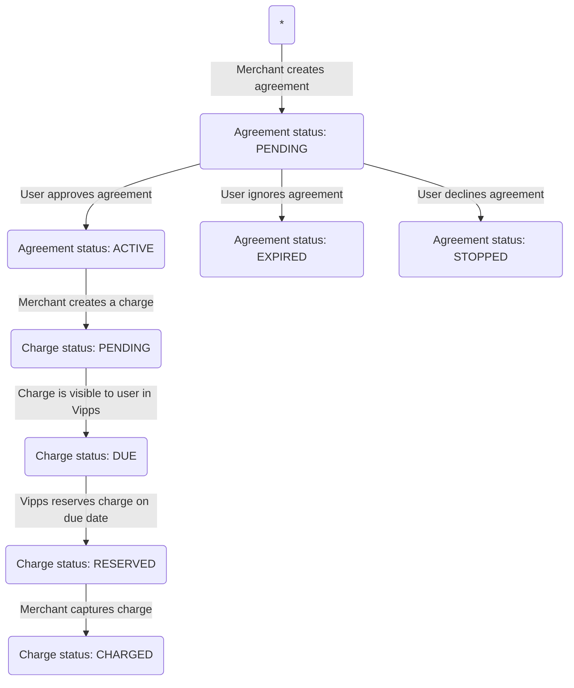

```mermaid
flowchart TD
    *(*) -- Merchant creates agreement --> B(Agreement status: PENDING);
    B -- User approves agreement --> C(Agreement status: ACTIVE)
    B -- User ignores agreement --> D(Agreement status: EXPIRED)
    B -- User declines agreement --> E(Agreement status: STOPPED)
    C -- Merchant creates a charge --> F(Charge status: PENDING)
    F -- Charge is visible to user in Vipps --> G(Charge status: DUE)
    G -- Vipps reserves charge on due date --> H(Charge status: RESERVED)
    H -- Merchant captures charge --> I(Charge status: CHARGED)
```