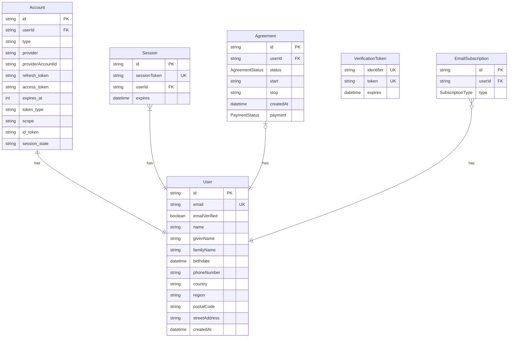

```mermaid
erDiagram
    Account ||--|| User : has
    Account {
        string id PK
        string userId FK
        string type
        string provider
        string providerAccountId
        string refresh_token
        string access_token
        int expires_at
        string token_type
        string scope
        string id_token
        string session_state
    }
    Session }|--|| User : has
    Session {
        string id PK
        string sessionToken "UK"
        string userId FK
        datetime expires
    }
    User {
        string id PK
        string email "UK"
        boolean emailVerified
        string name
        string givenName
        string familyName
        datetime birthdate
        string phoneNumber
        string country
        string region
        string postalCode
        string streetAddress
        datetime createdAt
    }
    Agreement |o--|| User : has
    Agreement {
        string id PK
        string userId FK
        AgreementStatus status
        string start
        string stop
        datetime createdAt
        PaymentStatus payment
    }
    VerificationToken {
        string identifier "UK"
        string token "UK"
        datetime expires
    }
    EmailSubscription }o--|| User : has
    EmailSubscription {
        string id PK
        string userId FK
        SubscriptionType type
    }
```
